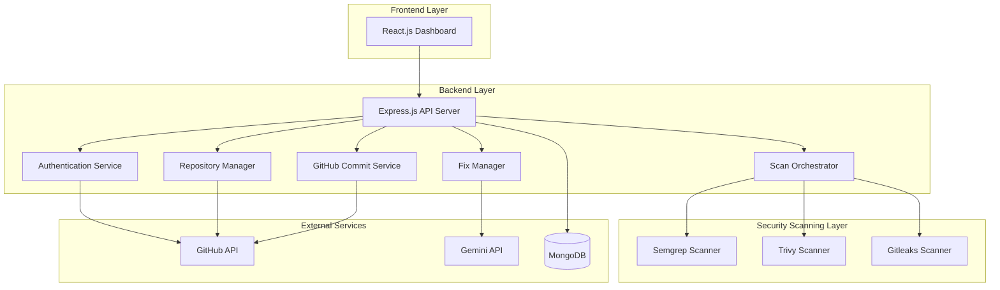

# Design Document: AI-Assisted Proactive Threat Detection and Mitigation DevSecOps Platform

## Overview

The DevSecOps Platform is a full-stack web application that provides automated security scanning and AI-assisted vulnerability remediation for GitHub repositories. The system follows a microservices-inspired architecture with clear separation between frontend, backend API, security scanning services, and external integrations.

The platform integrates three open-source security tools (Semgrep for code vulnerabilities, Trivy for dependency vulnerabilities, and Gitleaks for secret detection) and leverages Google's Gemini 2.5 Flash AI model for automated vulnerability correction. All operations are authenticated through GitHub OAuth, and fixed code is committed back to GitHub repositories seamlessly.

## Architecture

### High-Level Architecture



### Component Responsibilities

**Frontend Layer:**
- React.js single-page application
- User authentication flow
- Repository selection interface
- Vulnerability dashboard with filtering and sorting
- Code editor for manual fixes
- AI fix review interface
- Commit confirmation dialogs

**Backend API Layer:**
- RESTful API endpoints
- Request validation and error handling
- Session management
- Business logic orchestration
- Rate limiting and security middleware

**Authentication Service:**
- GitHub OAuth flow management
- Token storage and encryption
- Session validation
- Token refresh logic

**Repository Manager:**
- GitHub API integration for repository listing
- Repository file download and caching
- Directory structure preservation
- Temporary file management

**Scan Orchestrator:**
- Parallel execution of security scanners
- Result aggregation and normalization
- Severity level mapping
- Scan report generation

**Fix Manager:**
- Manual fix workflow coordination
- Gemini API integration for AI fixes
- Fix validation and preview
- Fix status tracking

**GitHub Commit Service:**
- Commit message generation
- Git operations (add, commit, push)
- Conflict detection and handling
- Branch management

## Components and Interfaces

### Frontend Components

#### AuthenticationComponent
```typescript
interface AuthenticationComponent {
  initiateGitHubLogin(): void
  handleOAuthCallback(code: string): Promise<void>
  logout(): void
  getAuthStatus(): AuthStatus
}

interface AuthStatus {
  isAuthenticated: boolean
  username: string | null
  avatarUrl: string | null
}
```

#### RepositoryListComponent
```typescript
interface RepositoryListComponent {
  fetchRepositories(): Promise<Repository[]>
  selectRepository(repoId: string): void
  getSelectedRepository(): Repository | null
}

interface Repository {
  id: string
  name: string
  fullName: string
  visibility: 'public' | 'private'
  lastUpdated: Date
  defaultBranch: string
}
```

#### VulnerabilityDashboardComponent
```typescript
interface VulnerabilityDashboardComponent {
  displayVulnerabilities(report: ScanReport): void
  filterBySeverity(level: SeverityLevel): void
  searchByFile(filename: string): void
  sortVulnerabilities(criteria: SortCriteria): void
  selectVulnerability(vulnId: string): void
}

interface ScanReport {
  id: string
  repositoryId: string
  timestamp: Date
  vulnerabilities: Vulnerability[]
  summary: VulnerabilitySummary
}

interface Vulnerability {
  id: string
  type: 'code' | 'dependency' | 'secret'
  severity: SeverityLevel
  title: string
  description: string
  filePath: string
  lineNumber: number
  scanner: 'semgrep' | 'trivy' | 'gitleaks'
  fixStatus: FixStatus
  codeSnippet: string
}

type SeverityLevel = 'critical' | 'high' | 'medium' | 'low'
type FixStatus = 'pending' | 'in_progress' | 'fixed' | 'verified'

interface VulnerabilitySummary {
  total: number
  bySeverity: Record<SeverityLevel, number>
  byStatus: Record<FixStatus, number>
}
```

#### CodeEditorComponent
```typescript
interface CodeEditorComponent {
  loadCode(filePath: string, lineNumber: number): void
  getModifiedCode(): string
  validateSyntax(): ValidationResult
  saveChanges(): Promise<void>
}

interface ValidationResult {
  isValid: boolean
  errors: SyntaxError[]
}
```

#### AIFixComponent
```typescript
interface AIFixComponent {
  requestAIFix(vulnerability: Vulnerability): Promise<AIFixProposal>
  displayProposal(proposal: AIFixProposal): void
  approveProposal(proposalId: string): Promise<void>
  rejectProposal(proposalId: string): void
}

interface AIFixProposal {
  id: string
  vulnerabilityId: string
  originalCode: string
  fixedCode: string
  explanation: string
  confidence: number
}
```

### Backend API Endpoints

#### Authentication Endpoints
```
POST   /api/auth/github/initiate     - Initiate GitHub OAuth flow
GET    /api/auth/github/callback     - Handle OAuth callback
POST   /api/auth/logout              - Logout user
GET    /api/auth/status              - Get authentication status
```

#### Repository Endpoints
```
GET    /api/repositories             - List user's repositories
POST   /api/repositories/:id/scan    - Initiate repository scan
GET    /api/repositories/:id/files   - Get repository file tree
```

#### Vulnerability Endpoints
```
GET    /api/vulnerabilities          - List vulnerabilities (with filters)
GET    /api/vulnerabilities/:id      - Get vulnerability details
PATCH  /api/vulnerabilities/:id      - Update vulnerability status
```

#### Fix Endpoints
```
POST   /api/fixes/manual             - Submit manual fix
POST   /api/fixes/ai                 - Request AI-generated fix
POST   /api/fixes/ai/:id/approve     - Approve AI fix
POST   /api/fixes/ai/:id/reject      - Reject AI fix
```

#### Commit Endpoints
```
POST   /api/commits                  - Commit fixes to GitHub
GET    /api/commits/:id/status       - Get commit status
```

#### Report Endpoints
```
GET    /api/reports                  - List scan reports
GET    /api/reports/:id              - Get specific report
```

### Backend Services

#### AuthenticationService
```typescript
interface AuthenticationService {
  generateOAuthUrl(): string
  exchangeCodeForToken(code: string): Promise<AccessToken>
  storeToken(userId: string, token: AccessToken): Promise<void>
  getToken(userId: string): Promise<AccessToken | null>
  refreshToken(userId: string): Promise<AccessToken>
  revokeToken(userId: string): Promise<void>
  encryptToken(token: string): string
  decryptToken(encryptedToken: string): string
}

interface AccessToken {
  token: string
  expiresAt: Date
  refreshToken: string
}
```

#### RepositoryManager
```typescript
interface RepositoryManager {
  listRepositories(accessToken: string): Promise<Repository[]>
  downloadRepository(repoId: string, accessToken: string): Promise<string>
  getFileTree(localPath: string): Promise<FileNode[]>
  cleanupTemporaryFiles(localPath: string): Promise<void>
}

interface FileNode {
  path: string
  type: 'file' | 'directory'
  size: number
  children?: FileNode[]
}
```

#### ScanOrchestrator
```typescript
interface ScanOrchestrator {
  scanRepository(localPath: string): Promise<ScanReport>
  runSemgrep(localPath: string): Promise<ScanResult>
  runTrivy(localPath: string): Promise<ScanResult>
  runGitleaks(localPath: string): Promise<ScanResult>
  aggregateResults(results: ScanResult[]): ScanReport
  normalizeSeverity(scannerSeverity: string, scanner: string): SeverityLevel
}

interface ScanResult {
  scanner: 'semgrep' | 'trivy' | 'gitleaks'
  vulnerabilities: RawVulnerability[]
  executionTime: number
  success: boolean
  error?: string
}

interface RawVulnerability {
  title: string
  description: string
  severity: string
  filePath: string
  lineNumber: number
  codeSnippet: string
  metadata: Record<string, any>
}
```

#### FixManager
```typescript
interface FixManager {
  applyManualFix(vulnId: string, fixedCode: string): Promise<void>
  requestAIFix(vulnerability: Vulnerability): Promise<AIFixProposal>
  applyAIFix(proposalId: string): Promise<void>
  validateFix(filePath: string, code: string): Promise<ValidationResult>
  updateFixStatus(vulnId: string, status: FixStatus): Promise<void>
}
```

#### GeminiService
```typescript
interface GeminiService {
  generateFix(vulnerability: Vulnerability, codeContext: string): Promise<AIFixProposal>
  buildPrompt(vulnerability: Vulnerability, codeContext: string): string
  parseResponse(response: string): AIFixProposal
}
```

#### GitHubCommitService
```typescript
interface GitHubCommitService {
  commitChanges(repoId: string, files: FileChange[], message: string, accessToken: string): Promise<CommitResult>
  generateCommitMessage(fixes: Vulnerability[]): string
  detectConflicts(repoId: string, files: FileChange[], accessToken: string): Promise<Conflict[]>
  pushToRemote(repoId: string, branch: string, accessToken: string): Promise<void>
}

interface FileChange {
  path: string
  content: string
  operation: 'modify' | 'delete' | 'create'
}

interface CommitResult {
  commitSha: string
  success: boolean
  conflicts: Conflict[]
}

interface Conflict {
  filePath: string
  reason: string
}
```

## Data Models

### MongoDB Collections

#### Users Collection
```typescript
interface UserDocument {
  _id: ObjectId
  githubId: string
  username: string
  email: string
  avatarUrl: string
  encryptedToken: string
  tokenExpiresAt: Date
  refreshToken: string
  createdAt: Date
  lastLoginAt: Date
}
```

#### Repositories Collection
```typescript
interface RepositoryDocument {
  _id: ObjectId
  userId: ObjectId
  githubRepoId: string
  name: string
  fullName: string
  visibility: 'public' | 'private'
  defaultBranch: string
  lastScannedAt: Date | null
  createdAt: Date
}
```

#### ScanReports Collection
```typescript
interface ScanReportDocument {
  _id: ObjectId
  repositoryId: ObjectId
  userId: ObjectId
  timestamp: Date
  vulnerabilities: VulnerabilityDocument[]
  summary: {
    total: number
    bySeverity: {
      critical: number
      high: number
      medium: number
      low: number
    }
    byStatus: {
      pending: number
      in_progress: number
      fixed: number
      verified: number
    }
  }
  scanDuration: number
  scannerResults: {
    semgrep: { success: boolean; count: number; error?: string }
    trivy: { success: boolean; count: number; error?: string }
    gitleaks: { success: boolean; count: number; error?: string }
  }
}
```

#### Vulnerabilities Collection
```typescript
interface VulnerabilityDocument {
  _id: ObjectId
  reportId: ObjectId
  repositoryId: ObjectId
  type: 'code' | 'dependency' | 'secret'
  severity: 'critical' | 'high' | 'medium' | 'low'
  title: string
  description: string
  filePath: string
  lineNumber: number
  scanner: 'semgrep' | 'trivy' | 'gitleaks'
  fixStatus: 'pending' | 'in_progress' | 'fixed' | 'verified'
  codeSnippet: string
  metadata: Record<string, any>
  createdAt: Date
  updatedAt: Date
}
```

#### Fixes Collection
```typescript
interface FixDocument {
  _id: ObjectId
  vulnerabilityId: ObjectId
  userId: ObjectId
  type: 'manual' | 'ai'
  originalCode: string
  fixedCode: string
  aiProposal?: {
    explanation: string
    confidence: number
    model: string
  }
  appliedAt: Date
  commitSha?: string
}
```

#### Commits Collection
```typescript
interface CommitDocument {
  _id: ObjectId
  repositoryId: ObjectId
  userId: ObjectId
  commitSha: string
  message: string
  branch: string
  fixedVulnerabilities: ObjectId[]
  timestamp: Date
  success: boolean
  conflicts: {
    filePath: string
    reason: string
  }[]
}
```


## Correctness Properties

A property is a characteristic or behavior that should hold true across all valid executions of a system—essentially, a formal statement about what the system should do. Properties serve as the bridge between human-readable specifications and machine-verifiable correctness guarantees.

### Authentication and Authorization Properties

**Property 1: OAuth Round-Trip Completeness**
*For any* user initiating GitHub OAuth login, the complete flow (redirect → authorization → token receipt → secure storage) should result in an authenticated session with an encrypted access token stored and retrievable.
**Validates: Requirements 1.1, 1.2, 1.3**

**Property 2: Token Expiration Triggers Re-authentication**
*For any* expired access token, attempting to use it for API operations should trigger a re-authentication prompt and prevent unauthorized access.
**Validates: Requirements 1.4**

**Property 3: Token Encryption Invariant**
*For any* access token stored in the system, retrieving it from storage should yield an encrypted value, and decrypting it should produce the original token value (encryption round-trip).
**Validates: Requirements 10.1**

**Property 4: Session Cleanup on Logout**
*For any* authenticated user session, logging out should result in session invalidation and complete removal of stored tokens from both session storage and database.
**Validates: Requirements 10.4**

### Repository Management Properties

**Property 5: Repository List Completeness**
*For any* authenticated user, fetching repositories should return all repositories accessible to that user's GitHub account with required fields (name, visibility, lastUpdated) present.
**Validates: Requirements 2.1, 2.2**

**Property 6: Directory Structure Preservation**
*For any* repository with nested directory structure, downloading and extracting the repository should preserve the exact directory hierarchy and file paths.
**Validates: Requirements 2.4**

**Property 7: Temporary File Cleanup**
*For any* repository scan operation, after scan completion (successful or failed), all temporary files should be deleted from the system.
**Validates: Requirements 10.5**

### Vulnerability Scanning Properties

**Property 8: All Scanners Invoked**
*For any* repository scan, all three security scanners (Semgrep, Trivy, Gitleaks) should be initiated regardless of individual scanner success or failure.
**Validates: Requirements 3.1**

**Property 9: Scanner Failure Resilience**
*For any* repository scan where one or more scanners fail, the remaining scanners should continue execution and the scan report should include results from successful scanners plus error logs for failed ones.
**Validates: Requirements 3.6, 9.2**

**Property 10: Scan Report Completeness**
*For any* completed scan, the generated scan report should include all required fields (vulnerability type, severity level, file location, line number, scanner source) for every detected vulnerability.
**Validates: Requirements 3.7**

**Property 11: Result Aggregation Correctness**
*For any* set of scanner results, aggregating them into a scan report should preserve all vulnerabilities from all scanners without duplication or loss, and the summary counts should match the actual vulnerability count.
**Validates: Requirements 3.5**

### Dashboard and Filtering Properties

**Property 12: Vulnerability Display Completeness**
*For any* scan report, the dashboard should display all vulnerabilities from the report with all required fields (severity, type, file, line number, fix status) visible.
**Validates: Requirements 4.1, 4.2**

**Property 13: Severity Filtering Correctness**
*For any* severity level filter applied to a vulnerability list, all displayed vulnerabilities should match the selected severity level, and all vulnerabilities of that severity should be displayed.
**Validates: Requirements 4.3**

**Property 14: File Search Filtering Correctness**
*For any* file name search query, all displayed vulnerabilities should have file paths matching the query, and all matching vulnerabilities should be displayed.
**Validates: Requirements 4.4**

**Property 15: Severity Sorting Correctness**
*For any* vulnerability list displayed on the dashboard, vulnerabilities should be sorted with Critical first, then High, then Medium, then Low, maintaining stable sort order within each severity level.
**Validates: Requirements 4.6**

**Property 16: Repository Filtering Correctness**
*For any* repository filter applied in multi-repository view, all displayed vulnerabilities should belong to the selected repository, and all vulnerabilities from that repository should be displayed.
**Validates: Requirements 12.3**

### Manual Fix Properties

**Property 17: Code Editor Loading Correctness**
*For any* vulnerability selected for manual correction, the code editor should load the correct file content with the vulnerable line highlighted and visible.
**Validates: Requirements 5.1**

**Property 18: Syntax Validation Prevents Invalid Saves**
*For any* code modification with syntax errors, attempting to save should be prevented and validation errors should be displayed to the user.
**Validates: Requirements 5.2, 5.5**

**Property 19: Fix Status Progression**
*For any* vulnerability undergoing manual correction, the fix status should progress from Pending → In Progress (on save) → Fixed (on completion), and status updates should be persisted to the database.
**Validates: Requirements 5.3, 5.4**

### AI-Assisted Fix Properties

**Property 20: AI Fix Request Completeness**
*For any* vulnerability submitted for AI correction, the request to Gemini API should include vulnerability details (type, severity, description), vulnerable code snippet, and surrounding code context.
**Validates: Requirements 6.1**

**Property 21: AI Model Specification**
*For any* AI fix request sent to Gemini API, the request should specify the gemini-2.5-flash model parameter.
**Validates: Requirements 6.7**

**Property 22: AI Fix Proposal Display**
*For any* successful AI fix response, the platform should display the proposal with original code, fixed code, and explanation before allowing user approval.
**Validates: Requirements 6.2**

**Property 23: AI Fix Application Updates Status**
*For any* approved AI fix proposal, applying the fix should update the vulnerability's fix status to Fixed and store the fix details in the database.
**Validates: Requirements 6.3, 6.4**

**Property 24: AI Fix Rejection Provides Alternatives**
*For any* rejected AI fix proposal, the platform should offer both manual correction and AI retry options to the user.
**Validates: Requirements 6.5**

### GitHub Commit Properties

**Property 25: Commit Message Generation Completeness**
*For any* set of fixed vulnerabilities being committed, the generated commit message should include the total count of fixes and a breakdown by severity level.
**Validates: Requirements 7.2, 7.3**

**Property 26: Commit Authentication**
*For any* commit operation to GitHub, the request should use the authenticated user's access token for authorization.
**Validates: Requirements 7.4**

**Property 27: Commit Success Updates Report**
*For any* successful commit to GitHub, all committed vulnerability fixes should have their fix status updated to Verified in the scan report.
**Validates: Requirements 7.5**

**Property 28: Default Branch Targeting**
*For any* commit operation where the user does not specify a branch, the commit should target the repository's default branch.
**Validates: Requirements 7.7**

### Data Persistence Properties

**Property 29: Scan Report Persistence Completeness**
*For any* generated scan report, storing it in MongoDB should preserve all fields (timestamp, repository ID, vulnerabilities, summary, scanner results) and retrieving it should return an equivalent report.
**Validates: Requirements 8.1, 8.2**

**Property 30: Historical Report Retrieval**
*For any* repository with multiple scan reports, querying historical reports should return all reports for that repository sorted by timestamp descending.
**Validates: Requirements 8.3**

**Property 31: Secret Sanitization in Storage**
*For any* scan report containing secrets detected by Gitleaks, storing the report in MongoDB should sanitize or redact the actual secret values while preserving vulnerability metadata.
**Validates: Requirements 10.3**

### Error Handling Properties

**Property 32: API Error Logging Completeness**
*For any* failed API call (GitHub, Gemini, or internal), the error log should include timestamp, endpoint/operation, error message, and relevant context.
**Validates: Requirements 9.1**

**Property 33: OAuth Failure Recovery**
*For any* GitHub OAuth authorization failure, the platform should display an error message and provide a retry mechanism without requiring full page reload.
**Validates: Requirements 1.5**

**Property 34: Repository Download Failure Handling**
*For any* failed repository download, the platform should log the error with repository details and notify the user without blocking other operations.
**Validates: Requirements 2.5**

**Property 35: Rate Limit Handling**
*For any* GitHub API rate limit response, the platform should notify the user, extract the reset time, and queue retry after the limit resets.
**Validates: Requirements 9.3**

**Property 36: AI API Failure Fallback**
*For any* Gemini API failure when requesting a fix, the platform should log the error and offer manual correction as an alternative.
**Validates: Requirements 6.6, 9.4**

**Property 37: Database Failure Graceful Degradation**
*For any* MongoDB connection failure, the platform should display an error message and disable operations requiring database access while allowing read-only operations from cache.
**Validates: Requirements 9.5**

**Property 38: Commit Conflict Resolution**
*For any* commit that fails due to conflicts, the platform should detect the conflicts, notify the user with conflict details, and provide resolution options.
**Validates: Requirements 7.6**

### Security Properties

**Property 39: HTTPS Enforcement**
*For any* external API call (GitHub API, Gemini API), the request URL should use HTTPS protocol.
**Validates: Requirements 10.2**

**Property 40: Rate Limiting Enforcement**
*For any* user making scan requests, exceeding the configured rate limit (e.g., 10 scans per hour) should result in request rejection with appropriate error message.
**Validates: Requirements 10.6**

### User Interface Feedback Properties

**Property 41: Operation Progress Indicators**
*For any* long-running operation (scan, download, AI fix, commit), the UI should display a progress indicator or loading state while the operation is in progress.
**Validates: Requirements 11.1, 11.2, 11.3, 11.4**

**Property 42: Operation Completion Notifications**
*For any* completed operation (successful or failed), the platform should display a notification indicating success or failure with relevant details.
**Validates: Requirements 11.5**

### Multi-Repository Properties

**Property 43: Sequential Scan Execution**
*For any* set of multiple selected repositories, scanning should execute sequentially (one repository completes before the next begins) in the order of selection.
**Validates: Requirements 12.2**

**Property 44: Repository Context Switching**
*For any* user switching from one repository to another in the dashboard, the displayed vulnerabilities should update to show only vulnerabilities from the newly selected repository.
**Validates: Requirements 12.5**

**Property 45: Report Repository Attribution**
*For any* scan report displayed in multi-repository view, the report should clearly indicate which repository it belongs to through repository name and ID.
**Validates: Requirements 12.4**

## Error Handling

### Error Categories

**Authentication Errors:**
- OAuth authorization failures
- Token expiration
- Invalid or revoked tokens
- Session timeout

**External API Errors:**
- GitHub API failures (network, rate limits, permissions)
- Gemini API failures (network, quota, invalid requests)
- MongoDB connection failures

**Scanning Errors:**
- Scanner tool execution failures
- Invalid repository structure
- Unsupported file types
- Scanner timeout

**Commit Errors:**
- Merge conflicts
- Permission denied
- Branch protection rules
- Network failures during push

### Error Handling Strategy

**Graceful Degradation:**
- Continue operations when non-critical components fail
- Provide partial results when some scanners fail
- Cache data to support read operations during database outages

**User Notification:**
- Display clear, actionable error messages
- Provide retry mechanisms for transient failures
- Offer alternative workflows when primary path fails

**Logging and Monitoring:**
- Log all errors with full context
- Track error rates and patterns
- Alert administrators for critical failures

**Recovery Mechanisms:**
- Automatic retry with exponential backoff for transient failures
- Token refresh for expired credentials
- Queue-based retry for rate-limited operations

### Error Response Format

```typescript
interface ErrorResponse {
  error: {
    code: string
    message: string
    details?: Record<string, any>
    retryable: boolean
    suggestedAction?: string
  }
  timestamp: Date
  requestId: string
}
```

## Testing Strategy

### Dual Testing Approach

The platform will employ both unit testing and property-based testing to ensure comprehensive coverage:

**Unit Tests:**
- Specific examples demonstrating correct behavior
- Edge cases (empty repositories, malformed data, boundary conditions)
- Integration points between components
- Error conditions and failure scenarios
- Mock external dependencies (GitHub API, Gemini API, scanners)

**Property-Based Tests:**
- Universal properties that hold for all inputs
- Comprehensive input coverage through randomization
- Minimum 100 iterations per property test
- Each property test references its design document property

### Testing Framework Selection

**Backend (Node.js/Express):**
- Unit Testing: Jest
- Property-Based Testing: fast-check
- API Testing: Supertest
- Mocking: Jest mocks for external APIs

**Frontend (React):**
- Unit Testing: Jest + React Testing Library
- Property-Based Testing: fast-check
- Component Testing: React Testing Library
- E2E Testing: Playwright (for critical user flows)

**Database:**
- MongoDB Memory Server for isolated testing
- Test data factories for generating realistic data

### Property Test Configuration

Each property-based test will:
- Run minimum 100 iterations with randomized inputs
- Include a comment tag referencing the design property
- Tag format: `// Feature: devsecops-platform, Property {number}: {property_text}`
- Use appropriate generators for domain-specific data (repositories, vulnerabilities, tokens)

### Test Organization

```
tests/
├── unit/
│   ├── auth/
│   ├── repositories/
│   ├── scanning/
│   ├── fixes/
│   └── commits/
├── properties/
│   ├── auth.properties.test.ts
│   ├── scanning.properties.test.ts
│   ├── fixes.properties.test.ts
│   └── commits.properties.test.ts
├── integration/
│   ├── scan-workflow.test.ts
│   ├── fix-workflow.test.ts
│   └── commit-workflow.test.ts
└── e2e/
    ├── full-scan-flow.spec.ts
    └── ai-fix-flow.spec.ts
```

### Test Data Generators

Property-based tests will use custom generators for:
- Valid and invalid GitHub tokens
- Repository structures with various file types
- Vulnerability data with different severities
- User sessions and authentication states
- Scanner output in various formats
- Commit scenarios with and without conflicts

### Coverage Goals

- Unit test coverage: Minimum 80% code coverage
- Property test coverage: All 45 correctness properties implemented
- Integration test coverage: All critical user workflows
- E2E test coverage: Authentication → Scan → Fix → Commit flow

### Continuous Integration

- Run all tests on every pull request
- Property tests run with 100 iterations in CI
- Extended property test runs (1000+ iterations) nightly
- Performance benchmarks for scanning operations
- Security scanning of the platform itself using the same tools
